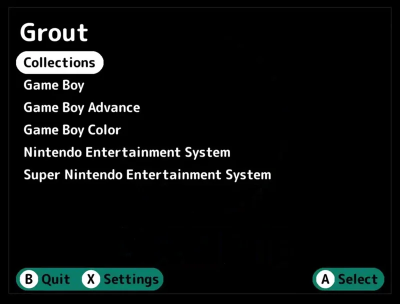

<!-- trunk-ignore-all(markdownlint/MD033) -->
<!-- trunk-ignore(markdownlint/MD041) -->

  
   
  
    <h3 style="font-size: 25px;">
A RomM Client for <a href="https://nextui.loveretro.games">NextUI</a> and <a href="https://muos.dev">muOS</a>
    </h3>

 

[![license-badge-img]][license-badge]
[![release-badge-img]][release-badge]
[![stars-badge-img]][stars-badge]
[![downloads-badge-img]][downloads-badge]
[![discord-badge-img]][discord-badge]

## Features

- Download games wirelessly from your RomM instance
  - Ability to select multiple games at once
- Download box art
- Multi-file games with automatic M3U file creation
- Save sync
- Game details screen
- Platform directory mapping on device
- Optional unzipping

---

### Save Sync

Save Sync allows you to store game saves on your RomM instance and use them across multiple devices.

**How does Save Sync work?**

Grout scans your local ROM and save directories on your device.

**When downloading saves:**

- If a game has no local save file but has a remote save file, Grout downloads the remote save.
- If a game has both a local and remote save file, and the remote save is newer, Grout will:
    - Back up your current save file into a hidden `.backup` folder within your saves directory with a timestamp
      appended to the filename.
    - Download the remote save file and rename it so your CFW recognizes it.

**When uploading saves:**

- If a game has a local save file but no remote save file, Grout uploads your local save.
- If a game has both a local and remote save file, and the local save is newer, Grout uploads your local save.

**Save Sync Notes**

- Grout uploads and downloads saves associated with the active RomM user configured in Grout.
    - If you have a shared user on your RomM instance, use this feature carefully.

- Grout **does not** sync save states.
    - If you use save states with autoloading enabled, you will need to reset your emulator to load a downloaded save
      file.
  
---

## Installation

### NextUI Setup

Grout has been tested on the following devices running NextUI:

- TrimUI Brick
- TrimUI Smart Pro

**Installation Steps:**

1. Ensure your TrimUI device has NextUI installed on an SD card.
2. Connect your device to a Wi-Fi network.
3. Install Grout using one of these methods:
    - **Recommended:** Use the NextUI Pak Store found in the `Tools` menu. Navigate to the `ROM Management` category and
      install Grout.
    - **Manual:** Download
      the [latest Grout release](https://github.com/rommapp/grout/releases/latest/download/Grout.pak.zip) for NextUI,
      unzip it, and place the `Grout.pak` directory into `SD_ROOT/Tools/tg5040`.
4. Launch Grout from the `Tools` menu and enjoy!

---

### muOS Setup

Grout has been tested on the following devices running muOS 2508.4 Loose Goose:

**Anbernic:**

- RG34XX
- RG35XX-H
- RG35XXSP
- RG40XXV

**TrimUI:**

- Brick
- Smart Pro

Please help verify compatibility on other devices by reporting your results!

**Installation Steps:**

1. Ensure your device is running muOS.
2. Download the [latest Grout release](https://github.com/rommapp/grout/releases/latest/download/Grout.muxapp) for muOS.
3. Transfer the `Grout.muxapp` file to an `ARCHIVE` folder on your device:
    - `/mnt/mmc/ARCHIVE` or `/mnt/sdcard/ARCHIVE`
4. Open Applications and launch Archive Manager.
5. Select `[SDX-APP] Grout` from the list and let it extract to your applications directory.
6. Exit Archive Manager.
7. Find an [input mapping config](/.github/resources/input_mappings) for your device.
    - If one does not exist, try a config for a different device.
    - If that does not
      work, [create an issue](https://github.com/rommapp/grout/issues/new?template=button-mapping-request.md) to request
      a mapping for your device.
8. Save the input mapping JSON file as `input_mapping.json` and transfer it to the Grout application folder:
    - `/mnt/mmc/MUOS/application/Grout` or `/mnt/sdcard/MUOS/application/Grout`
9. Select `Apps` on the main menu, launch Grout, and enjoy!

## Need Help? Found a Bug? Have an Idea?

Please [create an issue](https://github.com/rommapp/grout/issues/new/choose) and fill out the template completely.

## Spread Joy!

A significant amount of time has been spent building Grout.

If you enjoy using Grount and feel inclined to pay it forward, go do something nice for someone! ❤️

✌🏻

<!-- Badges -->

[license-badge-img]: https://img.shields.io/github/license/rommapp/grout?style=for-the-badge&color=007C77

[license-badge]: LICENSE

[release-badge-img]: https://img.shields.io/github/v/release/rommapp/grout?sort=semver&style=for-the-badge&color=007C77

[release-badge]: https://github.com/rommapp/grout/releases

[stars-badge-img]: https://img.shields.io/github/stars/rommapp/grout?style=for-the-badge&color=007C77

[stars-badge]: https://github.com/rommapp/grout/stargazers

[downloads-badge-img]: https://img.shields.io/github/downloads/rommapp/grout/total?style=for-the-badge&color=007C77

[downloads-badge]: https://github.com/rommapp/grout/releases

[discord-badge-img]: https://img.shields.io/badge/discord-7289da?style=for-the-badge&color=007C77

[discord-badge]: https://discord.gg/P5HtHnhUDH

<!-- Links -->

[discord-invite]: https://invidget.switchblade.xyz/P5HtHnhUDH

[discord-invite-url]: https://discord.gg/P5HtHnhUDH

[oc-donate-img]: https://opencollective.com/romm/donate/button.png?color=blue

[oc-donate]: https://opencollective.com/romm
